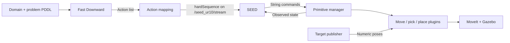

**Run pick and place using Fast Downward**

The `pddl_to_seed` command reads your domain and problem files, runs Fast Downward,
translates the resulting actions, and sends the sequence to SEED. SEED then
starts the existing primitives and checks their feedback.



Fast Downward decides **which actions to run and in which order**. SEED manages
their execution. MoveIt plans the arm movements. The current example uses the
Gazebo UR10 and red connector.

**Try the included example**

For a new installation, follow the [simulation setup](../README.md#build-and-run-the-ur10-simulation).
The simulation image includes the planner command. For an existing `tim_ur10`
container, these source changes only require rebuilding this Python package:

```bash
# Inside tim_ur10:
cd /home/user/ros2_ws
source /opt/ros/humble/setup.bash
source install/local_setup.bash
colcon build --symlink-install --packages-select task_planner
source install/local_setup.bash
```

Use three terminals attached to the same container, with the same ROS domain.
From the host, `./docker_attach.sh tim_ur10` opens another shell.

1. Start a fresh simulation and wait for the robot controllers and objects:

   ```bash
   ros2 launch ur10_primitives pick_place.launch.py
   ```

2. Start SEED and leave it waiting for requests:

   ```bash
   ros2 run seed seed ur10
   ```

3. Generate and inspect a plan:

   ```bash
   source /home/user/ros2_ws/install/local_setup.bash
   planner_share="$(ros2 pkg prefix task_planner)/share/task_planner"
   ros2 run task_planner pddl_to_seed \
     --domain "$planner_share/pddl/ur10_pick_place_domain.pddl" \
     --problem "$planner_share/pddl/ur10_pick_place_problem.pddl" \
     --mapping "$planner_share/config/ur10_action_mapping.yaml"
   ```

Without `--execute`, this prints the plan and sends no commands. To generate
and submit it for execution, run:

```bash
ros2 run task_planner pddl_to_seed \
  --domain "$planner_share/pddl/ur10_pick_place_domain.pddl" \
  --problem "$planner_share/pddl/ur10_pick_place_problem.pddl" \
  --mapping "$planner_share/config/ur10_action_mapping.yaml" \
  --execute
```

Use this **instead of typing `pick_place_demo`** at the SEED prompt. There is no
need to start `planner_node` separately: this command calls Fast Downward directly.
It sends one request to `/seed_ur10/stream`:

```text
hardSequence([move_a_b(pick),pick,move_a_b(place),place])
```

SEED sends each primitive command on `/ur10/primitives/command`. It advances when
the reported goal is true: `arm.at(pick)`, `object.held`, `arm.at(place)`, then
`object.placed`. Watch the SEED console or `ros2 topic echo /ur10/primitives/status`.
The command's “Submitted once” message confirms submission, **not task completion**.

**Plug in your own files**

You need three files:

| File | What it describes |
| --- | --- |
| Domain PDDL | Available actions, their preconditions, and expected effects. |
| Problem PDDL | Objects, the initial situation, and the desired goal. |
| Mapping YAML | How each planned action becomes an existing SEED task. |

The included [mapping](../src/task_planner/config/ur10_action_mapping.yaml) is:

```yaml
actions:
  "(move-a-b home pick)": "move_a_b(pick)"
  "(pick red-connector pick)": "pick"
  "(move-a-b pick place)": "move_a_b(place)"
  "(place red-connector place)": "place"
```

The left side is the complete action that Fast Downward outputs, including
object and location names. The right side is the existing SEED task. For your
files, adapt the left sides to their action names and arguments, and run
with `--domain`, `--problem`, and `--mapping` pointing to those files **inside the
container**. Files under TIM's `src` directory are visible at
`/home/user/ros2_ws/src` in the container.

This mapping is deliberately specific to one connector and the two existing
pick/place targets. An action for a different object or destination must not be
mapped to the same command unless the target provider is configured for that
object or destination. Actions requiring new skills need corresponding primitive
plugins and SEED tasks; this command currently accepts only `move_a_b(pick)`,
`pick`, `move_a_b(place)`, and `place`.

The PDDL names describe locations symbolically. The target publisher still
provides their numeric poses. You can later replace it with perception without
putting coordinates into SEED.

**Your `pick_place_demo` PDDL files**

The files under `src/seed/BBS/inverse/domains` also work with Fast Downward.
The original example problem asks to move `object1` from `loc1` to `loc3`.
Changing the problem can change the returned plan. The added
[`pick_place_demo_action_mapping.yaml`](../src/task_planner/config/pick_place_demo_action_mapping.yaml)
uses this explicit demo interpretation:

| PDDL name | Meaning in this Gazebo demo |
| --- | --- |
| `robot1` | The UR10. |
| `object1` | The red connector. |
| `loc1` | The externally published pick target. |
| `loc3` | The externally published place target. |

With the simulation and SEED running, first inspect the plan:

```bash
cd /home/user/ros2_ws
ros2 run task_planner pddl_to_seed \
  --domain src/seed/BBS/inverse/domains/pick_place_demo_domain.pddl \
  --problem src/seed/BBS/inverse/domains/pick_place_demo_problem.pddl \
  --mapping src/task_planner/config/pick_place_demo_action_mapping.yaml
```

Add `--execute` to that command to submit it. Fast Downward produces:

```text
(move_a_b robot1 home loc1)
(pick robot1 object1 loc1)
(move_a_b robot1 loc1 loc3)
(place robot1 object1 loc3)
```

These become the same four SEED tasks as the bundled example. `object2` is in the
PDDL problem but is not involved in its current goal or plan. This mapping does
not implement execution for `object2`, `loc2`, or `loc4`. Selecting poses and
feedback for multiple objects will require extending the execution interface.

**What happens, in order**

1. You launch Gazebo, MoveIt, the target publisher, and the primitive manager.
   The manager loads the three primitive plugins. Starting these nodes does not
   itself request a pick-and-place task.
2. You start SEED. It receives observed facts from the manager and waits for tasks.
3. Each call to `pddl_to_seed` reads the domain, problem, and mapping files again.
   Fast Downward uses the problem's initial facts and goal to compute a new plan.
4. The command checks that every planned action has a mapping. Without
   `--execute`, it stops after showing the plan. With `--execute`, it publishes
   the mapped sequence once on `/seed_ur10/stream`.
5. SEED expands the sequence into its task definitions. Its `rosAct` behaviors
   publish String commands on `/ur10/primitives/command`. They may repeat a
   command while waiting; the manager prevents duplicate concurrent execution.
6. The manager invokes the selected plugin. The plugin reads its external pose
   target and uses MoveIt and the simulated gripper to perform the operation.
   `move_a_b` handles travel; `pick` and `place` handle local descent, grasp or
   release, and retreat.
7. The manager publishes observed facts on `/seed_ur10/state`. SEED checks the
   current task's goal, then advances to the next step. A goal already true may
   be skipped. Sending a command alone never proves that the task finished.
8. When the final task's goal is true, SEED reports sequence success.

**Change `problem.pddl` and run again**

Editing a PDDL file does not change a sequence that is already running. After
saving the file, invoke `pddl_to_seed` again to compute a new plan. PDDL and YAML
edits need no recompilation. Make sure `--problem` points to the file you edited;
the bundled example and `pick_place_demo_problem.pddl` are different files.

For example, with the original empty-gripper initial state, changing the goal
from `(objectAt object1 loc3)` to `(gripperHolding robot1 object1)` asks the planner
to stop after picking. With the existing mapping, the sequence becomes:

```text
move_a_b(pick) → pick
```

Changing the goal to the already true `(objectAt object1 loc1)` produces an
empty plan. Changing a symbolic location name does not change its coordinates:
the mapping selects the task, and the target publisher supplies the pose.
A newly generated action needs a matching entry and an implemented primitive.

For each experiment:

1. Let the previous task finish or cancel it and confirm its motion has ended.
2. Make the problem's initial facts agree with the actual starting state. For
   the original example, restarting both SEED and the simulation restores a
   predictable starting point. Editing PDDL alone does not reset Gazebo.
3. Save the changes and run the command without `--execute` to inspect the plan.
4. Run it with `--execute` and watch SEED and `/ur10/primitives/status`.

Typing `pick_place_demo` continues to use the fixed recipe in the LTM. Use
`pddl_to_seed` when you want edits to the PDDL problem to determine the sequence.

**What the first integration does and does not automate**

- The problem's initial facts must match the scene. They are not yet generated
  from perception or ROS feedback. The example assumes the connector is at the
  original pick position and the gripper is empty. To repeat this exact example,
  stop SEED and the simulation, then start both fresh.
- The entire plan must have valid mappings before anything is submitted.
  Planning errors, timeouts, and unmapped actions send no task to SEED. Each
  planning call uses its own temporary files, so an older plan cannot be reused
  accidentally after a failure. An already-satisfied PDDL goal produces an empty
  plan and sends no commands.
- Execution feedback drives SEED's progress. The existing manager latches
  `manipulation.failed` on a primitive failure. This integration does not yet
  generate a new PDDL problem or replan after an execution failure. Do not submit
  another task while a previous task is running.
- The default search is `astar(lmcut())`, with a 30-second planning timeout.
  `--search` and `--timeout` can change these. Fast Downward supports classical
  PDDL planning and action costs; temporal actions and general numeric planning
  require another model or planner. See its [PDDL support documentation](https://www.fast-downward.org/latest/documentation/pddl-support/).

The UR10 workflow above uses the existing SEED ROS stream and task definitions.
It does not depend on the older C++ `plan` behavior or the file paths configured
in that behavior. The `--domain` and `--problem` arguments select the files used
by `pddl_to_seed`.
