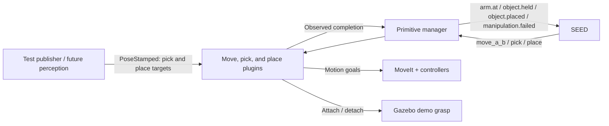

# Step 3: parametric pick and place

The first target source is a small ROS test publisher. The first object is the
red connector from the copied CRF assembly scene. SEED requests three distinct
primitives: `move_a_b`, `pick`, and `place`. Commands use symbolic location names;
numeric positions and orientations stay outside SEED. Target poses, frame transforms, motion planning, and
grasp offsets belong below SEED, in the target provider and primitive plugins.
Each invocation snapshots its target; subsequent pose updates apply to the next
invocation.



The Gazebo demonstration explicitly attaches/detaches the connector at the
gripper after reaching the grasp pose. This models object holding while we
develop motion and execution interfaces; it does not validate a contact-based
physical grasp. The asymmetric fingers remain a separate, lower-priority issue.

## Start the demonstration

The [gripper exercise](ur10-gripper.md) explains the container setup. The scene
is bundled in `simulation/use_case_sim`, so no CRF checkout is needed. Build the
updated image on the host with `./docker_sim_build.sh`. To use that image in a new
container, run `./docker_sim_run.sh tim_pick_place`. An existing container keeps
its original image.

Stop the previous gripper exercise's applications before starting this combined
launch in the same ROS domain. Inside the container:

```bash
ros2 launch ur10_primitives pick_place.launch.py
```

This launches the copied `use_case_sim/launch/assembly_task.launch.py`, with a
world containing the demo grasp plugin, plus MoveIt, the primitive manager, and
the test target publisher. Wait for the robot controllers and both loose
objects to finish spawning.

In another terminal inside the same container:

```bash
ros2 run seed seed ur10
```

At the SEED prompt enter:

```text
pick_place_demo
```

The connector moves from the middle of the scene to the free table area at
approximately `(0.50, 0.35, 0.815)` m in `world`. SEED executes the library's
`hardSequence([move_a_b(pick),pick,move_a_b(place),place])`. Fast Downward is not generating this sequence yet.

For a first exercise without SEED, send the four commands yourself. Wait for
each command to report `succeeded` before sending the next one:

```bash
ros2 topic echo /ur10/primitives/status
# In another attached terminal, one command at a time:
ros2 topic pub --once /ur10/primitives/command std_msgs/msg/String '{data: "move_a_b(pick)"}'
ros2 topic pub --once /ur10/primitives/command std_msgs/msg/String '{data: pick}'
ros2 topic pub --once /ur10/primitives/command std_msgs/msg/String '{data: "move_a_b(place)"}'
ros2 topic pub --once /ur10/primitives/command std_msgs/msg/String '{data: place}'
```

If attachment reports that the container is not running, use the updated
`./docker_attach.sh tim_ur10` from the host: it now starts the existing container
before opening a shell. The VS Code folder-open tasks start both `tim_cnt` and
`tim_ur10`; having VS Code open alone does not guarantee that a container is
running. Reload the VS Code window to activate newly added automatic tasks.

## If Gazebo or RViz does not open

`Invalid MIT-MAGIC-COOKIE-1 key` or `could not connect to display` means the
container cannot authenticate with your desktop. This can happen after logging
out or rebooting, because the desktop's X11 cookie changes.

Stop the failed launch with Ctrl+C. From a **host desktop terminal**, run:

```bash
./docker_attach.sh tim_ur10
```

The attach script now refreshes the simulation container's display cookie and
passes the current `DISPLAY`. Inside the attached shell, launch again:

```bash
ros2 launch ur10_primitives pick_place.launch.py
```

`./docker_sim_run.sh` also refreshes the cookie. To refresh only the cookie while
keeping an existing shell, run `./docker_sim_auth.sh` on the host. If `DISPLAY`
has changed, open a new attached shell so it gets the new display value.

The simulation world includes its light and ground directly, so it does not
require cached `sun` or `ground_plane` models. The Octomap warning about no 3D
sensor plugin is separate: this demo uses the configured collision geometry
and does not configure a depth-camera mapping plugin.

## Change the parameters without changing SEED

The test publisher sends fresh poses at 5 Hz. Its defaults are in
[`targets.yaml`](../src/ur10_primitives/config/targets.yaml). For example, before
starting the task, change the destination:

```bash
ros2 param set /pick_place_targets place_position '[0.5, -0.35, 0.835]'
```

After the default cycle, the object is at the first destination. To pick it there
and move it to the other side of the table, set:

```bash
ros2 param set /pick_place_targets pick_position '[0.5, 0.35, 0.825]'
ros2 param set /pick_place_targets place_position '[0.5, -0.35, 0.835]'
```

At the SEED console, type `forget(pick_place_demo)`, then `pick_place_demo`.
Resetting a task does not put the object back at its original position; the pick
target must follow the object's actual location. A pose update received during
an invocation applies to the next invocation, so it cannot redirect an active
motion halfway through.

| Interface | Contract |
| --- | --- |
| `/ur10/targets/pick` | `geometry_msgs/PoseStamped`: desired grasp TCP pose. |
| `/ur10/targets/place` | `geometry_msgs/PoseStamped`: desired release TCP pose. |
| `/ur10/primitives/command` | `std_msgs/String`: `move_a_b(pick)`, `move_a_b(place)`, `pick`, `place`, `cancel`, `stop`, `reset`. |
| `/ur10/primitives/status` | JSON status and failure details. |
| `/seed_ur10/state` | Boolean facts; leading `-` means false. |
| `/ur10/demo/object_pose` | Ground-truth connector pose from Gazebo, used to verify lift/release. |
| `/ur10/demo/holding` | Whether the simulation attachment exists. |

Targets specify the **grasp TCP**, not the wrist origin or an arbitrary detected
object frame. The TCP is 0.15 m along `tool0`'s local Z axis. The default quaternion
`[x,y,z,w] = [1,0,0,0]` points that axis downward. Positions are in metres. Pick Z
is 0.825 m, near the connector centre above the 0.8 m table; release Z is 0.835 m
to leave a small settling gap. The approach and retreat are 0.10 m vertically
above the target in `world`.

Each target needs a nonempty frame, a unit quaternion, finite coordinates, and a
current ROS timestamp. With simulation time enabled, use `/clock`. Targets older
than two seconds, future/zero timestamps, or unavailable TF transforms are
rejected before motion. A fresh, valid target can still be unreachable or in
collision; the planner rejects those motions.

To replace the publisher with perception:

```bash
ros2 launch ur10_primitives pick_place.launch.py target_publisher:=false
```

Publish the same two topics from the perception/task-context node. Convert a
detected object's pose into a grasp TCP pose there, including any grasp offset;
provide the camera-to-world TF if using a camera frame. No SEED schema changes
are needed. This first backend still verifies and attaches the scene's named
red connector; selecting arbitrary objects is a later extension.

## What the plugins do

There are three separate exported plugin classes, each with its own source file.
Their short `stages()` methods show exactly which steps belong to each skill.
The manager loads them through [`pick_place.yaml`](../src/ur10_primitives/config/pick_place.yaml).

| Primitive | Implementation | Responsibility |
| --- | --- | --- |
| `move_a_b(Target)` | [MoveABPrimitive](../src/ur10_primitives/src/move_a_b_primitive.cpp) | Travel from the current measured TCP pose (A) to the approach above the named target (B), then verify arrival. |
| `pick` | [PickPrimitive](../src/ur10_primitives/src/pick_primitive.cpp) | Check arrival above pick → open → descend → close → attach and update collision geometry → lift → verify. |
| `place` | [PlacePrimitive](../src/ur10_primitives/src/place_primitive.cpp) | Check arrival above place → descend → open → detach and update collision geometry → retreat → verify. |

`move_a_b(pick)` and `move_a_b(place)` are two invocations of the same move
primitive. The argument selects a pose topic; it is not a coordinate. A is taken
from the measured robot state, so there is no separate source-position argument.
B is 0.10 m above the selected target, using the configured approach height.
The move primitive never opens, closes, attaches, or releases the gripper.

`pick` and `place` retain their short vertical motions but never plan a transfer
between locations. They reject a command if the arm is not already at the
corresponding approach pose. Run the appropriate move primitive first. The
arrival check uses fresh TF feedback, a 0.02 m position tolerance, and a 0.08 rad
orientation tolerance. These tolerances are configurable.

SEED waits for `arm.at(pick)` or `arm.at(place)` after moving, `object.held` after
picking, and `object.placed` after placing. Arrival facts describe the current
measured pose and current fresh target, so they clear when the arm moves away,
the target changes beyond tolerance, or feedback becomes stale. SEED can skip a
move whose arrival goal is already satisfied.

Each invocation snapshots its own target. If the target moves between the
transfer and the local primitive, the local primitive checks the new target and
rejects execution when the arm is no longer above it. Keep the selected target
stable while the task is executing. If it changes during a transfer, that
invocation still completes at its saved pose; `arm.at(Target)` describes the
latest target, so SEED may continue waiting. Send `reset` after the motion ends
to allow the pending move command to use the new target. If the local primitive
has failed its arrival check, resolve the target, reset, and restart the sequence.

The classes share [motion, feedback, and cancellation helpers](../src/ur10_primitives/src/manipulation_primitive.cpp).
This avoids duplicating controller code while keeping each primitive's steps
visible in its own file. Transfers use OMPL; local descents and retreats use
collision-checked Cartesian paths. Incomplete paths are never executed.

Table/fixture and robot collisions are checked. The attached connector has a
collision representation while carried. Loose objects are not yet maintained as
a dynamic MoveIt collision scene. The Gazebo attachment disables connector
contacts while carrying it; consequently this remains a motion/control demo,
not a grasp-physics benchmark. Approach height, speed, TCP offset, and deadlines
are configured below SEED in YAML.

Failures latch `manipulation.failed` to inhibit repeated SEED commands. After
resolving the cause, send `reset`. Cancellation waits for any pending controller
or grasp operation to end; it does not automatically release a held object.
If a server disappears without returning its result, restore the server and
restart the manager after ensuring motion has stopped.

```bash
ros2 topic pub --once /ur10/primitives/command std_msgs/msg/String '{data: cancel}'
ros2 topic pub --once /ur10/primitives/command std_msgs/msg/String '{data: reset}'
```

## Verification

Run the protocol and publisher checks inside the container:

```bash
ROS_DOMAIN_ID=122 PYTHONDONTWRITEBYTECODE=1 python3 -m pytest -q -p no:cacheprovider \
  src/ur10_primitives/test
```

The checks exercise real manager/plugin processes with controlled backends:
explicit transfers, separation of transfer and grasp actions, measured arrival,
target snapshots, changed targets, invalid/stale input, planning failure, partial
Cartesian paths, cancellation, gripper lifecycle, and live publisher parameters.
Full SEED/Gazebo execution is checked separately.

Validation after the split: all 47 protocol/publisher checks passed. SEED also
completed the full Gazebo sequence, with the manager reporting success for
`move_a_b(pick)`, `pick`, `move_a_b(place)`, and `place`, in that order. The
connector settled at approximately `(0.50, 0.35, 0.815)` m in `world`.

## Deferred issue: asymmetric Robotiq motion

The user observed that the two fingers retract differently during closing.
Priority is lower than parametric pick and place. Reproduce and inspect mimic
joint configuration, signs, limits, and Gazebo joint measurements before choosing
a fix. The current empty-gripper goal checks only the actuated left knuckle;
that check does not establish symmetric motion or an object grasp.
