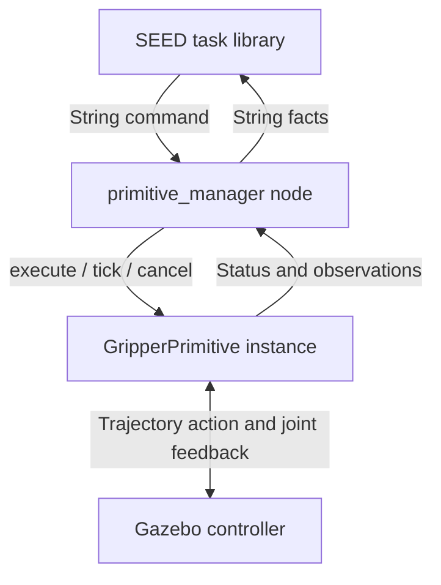

# Step 2b: primitives as plugins

The working gripper demo now uses a C++ manager and plugins. It follows the
`PrimitiveBase` / `pluginlib` / YAML structure of `rover_manager` on
`origin/Three_level_navigation_system` (reviewed at commit `97c8727`). The Rover
checkout was left on its existing branch. The UR implementation has no Nav2
or rover dependencies.

The launch command and SEED task are the same:

```bash
ros2 launch ur10_primitives gripper.launch.py
# In another attached terminal:
ros2 run seed seed ur10
# At the SEED console:
gripper_demo
```

Run the copied Gazebo assembly scene first, as in the
[gripper exercise](ur10-gripper.md). Run only one primitive manager on these
command/controller topics.

## Follow the execution path



SEED chooses the task and sequences its children. The manager accepts a command,
selects the configured plugin, and holds one active execution slot. The plugin
owns the action client, measured-state observation, timeout checks, and controller
cancellation. Its callbacks and the manager run in a single-threaded ROS executor.
There is one manager process; plugins are C++ objects loaded into that process.

| File | What to read there |
| --- | --- |
| [`primitive_base.hpp`](../src/primitive_manager/include/primitive_manager/primitive_base.hpp) | Common interface, execution statuses, `busy()`, and observations. |
| [`manager.cpp`](../src/primitive_manager/src/manager.cpp) | Plugin loading, dispatch, duplicate handling, execution results, and SEED publications. |
| [`command.hpp`](../src/primitive_manager/include/primitive_manager/command.hpp) | Parsing of atoms and `primitive(arg1,arg2)` commands. |
| [`gripper_primitive.cpp`](../src/ur10_primitives/src/gripper_primitive.cpp) | Robotiq controller action, joint feedback, and cancellation. |
| [`primitives_plugins.xml`](../src/ur10_primitives/primitives_plugins.xml) | Mapping from configured plugin type to the exported C++ class/library. |
| [`gripper.yaml`](../src/ur10_primitives/config/gripper.yaml) | Enabled primitives, targets, topics, and controller settings. |
| [`seed_ur10_LTM.prolog`](../src/seed/LTM/seed_ur10_LTM.prolog) | SEED schemas and the close/open demo. |

For `close_gripper`, the manager looks up that name in its configured plugin map.
It calls `execute({})` on the corresponding `GripperPrimitive`. The plugin sends
a trajectory to 0.75 rad and waits for the action result and fresh measured joint
feedback. The manager then publishes the execution result and observed goal.
SEED sees `gripper.closed` and starts the next child in the sequence.

## Two commands, one implementation

The configuration instantiates the same class twice:

```yaml
primitives: [open_gripper, close_gripper]
open_gripper:
  plugin: ur10_primitives/GripperPrimitive
  target_position: 0.0
  state_fact: gripper.open
close_gripper:
  plugin: ur10_primitives/GripperPrimitive
  target_position: 0.75
  state_fact: gripper.closed
```

These entries sit under `ros__parameters` in the actual configuration. Shared
Robotiq settings sit under `gripper`. No command-specific `if/else` in the manager
knows how to open or close a gripper.

A third named finger position can use another instance of this class with a new
target and fact. The [pick-and-place exercise](pick-place-design.md) adds three separate classes
for `move_a_b`, `pick`, and `place`, using this same plugin interface.

## Lifecycle and invocation rules

`initialize()` runs once when the plugin is loaded. `execute(args)` starts an
invocation without blocking. The manager calls `tick()` every 50 ms and the
plugin processes ROS action callbacks. Normal completion is:

```text
IDLE → RUNNING → SUCCEEDED or FAILED → reset to IDLE
```

The manager retains the terminal result for SEED after resetting the plugin's
internal state. Cancellation has a separate pending phase:

```text
RUNNING → CANCELLING → controller ends → CANCELLED → reset to IDLE
```

A timeout can report `FAILED` while `busy()` remains true. The manager keeps that
execution slot occupied until the controller returns a terminal result. A late
accepted goal is cancelled. If the controller disappears indefinitely, recover
it and restart the manager; `reset` cannot bypass an unresolved motion.

- Repeated copies of an active command are ignored, matching SEED's `rosAct`.
- A conflicting command is rejected. Commands are not queued or automatically
  switched. Use `cancel`, wait for completion, then send the new command.
- A repeated completed command returns the previous result. To deliberately
  repeat it, send `reset` followed by that command. A different command starts a
  new invocation normally.
- `reset` is accepted only when idle. It clears the failure latch, execution
  facts, and duplicate cache. It does not command movement.
- `stop` is an alias for monitored cancellation. It is a software command and
  does not implement a hardware emergency stop.

For example:

```bash
ros2 topic pub --once /ur10/gripper/command std_msgs/msg/String '{data: cancel}'
ros2 topic echo /ur10/gripper/status
# Wait for the active primitive's cancelled result, then send a new command.
```

## Execution history and observed goals

The manager publishes both kinds of information on `/seed_ur10/state`:

| Fact | Meaning |
| --- | --- |
| `running(close_gripper)` | An invocation is in progress, including controller discovery. |
| `succeeded(close_gripper)` | That invocation completed successfully. |
| `failed(close_gripper)` | That invocation failed; cancellation may still be pending. |
| `cancelled(close_gripper)` | The cancelled invocation ended. |
| `gripper.closed` | Fresh feedback satisfies the closed target while the manager is idle and healthy. |
| `gripper.failed` | The manager's configured failure latch is set. |

Leading `-` clears a fact. Previous terminal facts for a command are cleared when
that command is executed again or when `reset` is received. An execution success
can remain true after the gripper position changes; it describes history. Stale
joint feedback clears the observed goal. During motion or a latched failure,
observed goal facts are inhibited. The existing SEED schemas use observed goals.

Changed facts are published immediately and the current set is refreshed once
per second for SEED instances that start later. Subscriber/publisher queues are
100 messages to accommodate these multi-fact updates.

## Adding a new implementation

1. Implement `PrimitiveBase` in a C++ class. Keep `initialize`, `execute`, `tick`,
   `cancel`, `reset`, `busy`, status, and feedback consistent with the contract.
   Return observed Boolean facts through `observe()` if the primitive has them.
2. Add the source to a shared library and export it with
   `PLUGINLIB_EXPORT_CLASS(YourClass, primitive_manager::PrimitiveBase)`.
3. Register its class in plugin XML and export that XML with
   `pluginlib_export_plugin_description_file(primitive_manager your_plugins.xml)`.
4. Add a named instance to YAML's `primitives` list and set its `.plugin` type and
   parameters. A separate plugin package must depend on `primitive_manager`.
5. Add its SEED schema and completion condition, then test direct topic execution
   before adding it to a SEED sequence.

The base interface contains no arm, gripper, or navigation messages. The current
manager deliberately executes one primitive at a time. Adding simultaneous arm
and gripper operations would require explicit resource ownership and scheduling.

## Build and test

New containers built with `./docker_sim_build.sh` include both packages. For an
existing container that ran the earlier Python package, stop the primitive node
and remove only that package's generated build/install directories once:

```bash
cd /home/user/ros2_ws
rm -rf build/ur10_primitives install/ur10_primitives
source /opt/ros/humble/setup.bash
MAKEFLAGS=-j2 CMAKE_BUILD_PARALLEL_LEVEL=2 colcon build --symlink-install \
  --executor sequential --packages-select primitive_manager ur10_primitives seed
source install/local_setup.bash
```

The SEED rebuild installs the larger state subscription queue. Open new attached
shells or source the updated workspace in existing ones. The Python executable
has been replaced by the C++ manager; use the launch file shown above.

Run the integration tests from an attached shell:

```bash
ROS_DOMAIN_ID=122 python3 -m pytest -q -p no:cacheprovider \
  src/ur10_primitives/test/test_gripper_protocol.py
```

The tests spawn the real manager and load the real plugin library against a
controllable action server. They exercise motion results, fresh feedback,
failures, malformed commands, duplicate/repeat handling, late goal acceptance,
confirmed cancellation, a paused simulation clock, and a third YAML-configured
gripper target.

Migration validation: all 16 protocol cases passed. The rebuilt simulation image
also completed two SEED `gripper_demo` cycles in the copied assembly scene,
confirming approximately 0.75 rad closed and 0.0 rad open. The workspace inside
the existing `tim_ur10` container was rebuilt, and its unchanged launch command
loaded both plugins.
