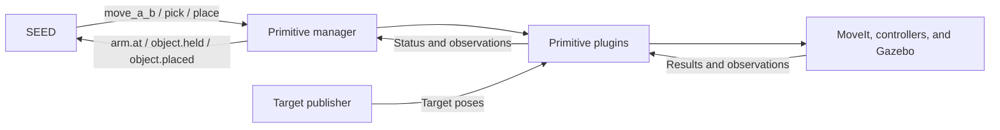

**SEED explained using pick and place**

SEED coordinates robot tasks. It starts tasks when they are allowed to run and
watches feedback to see whether their goals have been reached.

In our example, we want to move the red connector to another position on the
table. SEED requests: move above the connector → pick → move above the
destination → place. It checks feedback before advancing to each next step.

The robot skills, MoveIt, and the controllers handle the actual movements.

**Who does what?**

| Piece | Job in this example |
| --- | --- |
| SEED | Start tasks in the right order and check their goals. |
| `primitive_manager` | Receive a command and run the matching primitive plugin. |
| Primitive plugins | Implement three separate skills: `move_a_b`, `pick`, and `place`. |
| Target publisher | Supply the pick and place positions and orientations. |
| MoveIt | Plan arm movements. |
| Robot controllers | Make the joints follow those movements. |
| Gazebo | Simulate the robot, connector, and table. |

A **primitive** is a reusable robot skill with a simple interface. SEED can ask
for `pick` without knowing every movement needed to perform it. A primitive can
contain several steps; it does not have to be one joint movement.

Our three primitives have different jobs:

- `move_a_b(Target)` moves from the arm's current position to the approach pose
  above a named target, then checks arrival. It never grasps or releases.
- `pick` starts above the connector. It opens the gripper, moves down, closes,
  attaches the connector in Gazebo, lifts it, and checks the result.
- `place` starts above the destination. It moves down, opens the gripper,
  releases the connector, moves back up, and checks the result.

`pick` and `place` keep these short vertical motions. They refuse to start if
the arm has not arrived above the correct target. They never travel between
locations themselves.

In `move_a_b(pick)`, A is the measured current grasp-point pose. B is the pose
above the pick target. The word `pick` selects a topic containing the target
pose. `move_a_b(place)` uses the place target instead. SEED knows these names,
while the numeric poses remain outside SEED.

A **plugin** is a separate piece of code that the manager loads from its
configuration. We can add new skill plugins without putting all their code
inside the manager. Our current manager runs one primitive at a time.

**How SEED remembers and runs tasks**

SEED has three main parts:

1. **Long-Term Memory (LTM): the task recipe book.** It stores task definitions,
   called *schemas*, written in Prolog. A definition describes smaller tasks,
   conditions for running them, and the goal that means success.
2. **Working Memory (WM): the currently loaded tasks.** When we request
   `pick_place_demo`, SEED loads its recipe and smaller tasks into working memory.
3. **Behavior-Based System (BBS): the code SEED can run.** For example, `rosAct`
   publishes a ROS command. The robot primitive itself runs in the separate
   manager process.

Two useful words in SEED are **goal** and **releaser**. A goal describes when a
task is complete. A releaser is a condition that allows a task to run. For our
`pick` task, the goal is `object.held`. Its command is allowed while
`manipulation.failed` is false.

The recipe for our demo contains:

```text
hardSequence([move_a_b(pick),pick,move_a_b(place),place])
```

This means: move to pick → pick → move to place → place. We wrote this order
in the task library. SEED follows that recipe and checks feedback instead of
simply waiting for a fixed number of seconds.

**What happens when you enter `pick_place_demo`?**

1. SEED loads the recipe and activates `move_a_b(pick)`.
2. Its `rosAct` behavior publishes a `std_msgs/msg/String` containing
   `move_a_b(pick)` on `/ur10/primitives/command`.
3. The manager selects the move plugin and passes it the target name `pick`.
   The plugin reads the external pose and moves above it.
4. The manager reports `arm.at(pick)` on `/seed_ur10/state` when the measured
   arm pose matches the target approach pose.
5. SEED sends `pick` on the same command topic. The manager runs the pick plugin.
   After grasp and lift are verified, it reports `object.held`.
6. SEED sends `move_a_b(place)`. The move plugin carries the held connector to
   the place approach pose. The manager reports `arm.at(place)`.
7. SEED sends `place`. The place plugin lowers and releases the connector,
   retreats, and verifies the result.
8. The manager reports `object.placed`. SEED marks the sequence complete.

If an arrival goal is already true, SEED can skip that move. Arrival facts come
from current robot feedback and fresh targets, not an old successful command.



Sending a command does not mean it succeeded. SEED waits for the reported goal.
It may repeat a command while waiting; the manager ignores duplicates while
that primitive is running.

If a primitive fails, the manager reports `manipulation.failed`. The task rules
then stop SEED from repeatedly requesting the motion. We must resolve the cause
and clear the failure with `reset`. This demo does not automatically choose a
recovery plan. A leading `-` on a state message means false: `-object.held` means
the object-held fact is false.

**Where do the positions come from?**

The test publisher sends poses on `/ur10/targets/pick` and
`/ur10/targets/place`. Each `PoseStamped` message contains a position,
orientation, coordinate frame, and timestamp. Here, the pose describes where
we want the gripper's grasp point to be.

SEED does not receive these numeric poses. Each plugin saves its target when
execution starts, so later target updates cannot redirect an active motion.
Perception can replace the test publisher later, using the same topics and
keeping the same SEED task definitions.

**Where does PDDL fit?**

PDDL stands for *Planning Domain Definition Language*. It describes actions,
the starting situation, and a desired goal. A planner reads those descriptions
and searches for a sequence of actions.

- The **domain** describes available actions, when they can happen, and their
  expected results.
- The **problem** describes the starting situation and the goal for one task.

A simple model of our task says:

| Action | Required before the action | Expected after the action |
| --- | --- | --- |
| `move_a_b(Target)` | A destination has been selected. | The arm is above that destination. |
| `pick` | The arm is above pick, the gripper is empty, and the connector is available. | The robot holds the connector. |
| `place` | The arm is above place and the robot holds the connector. | The connector is at the destination and the gripper is empty. |

Starting situation: the connector is on the table and the gripper is empty.
Goal: the connector is at the destination. The included PDDL example produces:

```text
move_a_b(pick) → pick → move_a_b(place) → place
```

For this small example, that is the same order we wrote by hand. Planning becomes
more useful when there are more objects, actions, and possible orders.

The roles are:

```text
PDDL descriptions → Fast Downward chooses an action sequence
                 → SEED runs and monitors the sequence
                 → primitive_manager runs the robot skills
```

Fast Downward does **task planning**: which actions should happen, and in what
order? MoveIt does **motion planning**: how can the arm move to a target?
SEED connects the task sequence to execution and checks the reported results.

The planner's expected results are predictions. The robot still has to perform
each action successfully. Execution feedback must confirm what actually
happened before SEED advances.

**What is already connected in TIM?**

The UR10 demo now has a `pddl_to_seed` command:

1. It reads the domain and problem files and calls Fast Downward.
2. A mapping file translates each planned action into an existing SEED task.
   For example, `(pick red-connector pick)` becomes `pick`.
3. With `--execute`, it sends the complete `hardSequence` to `/seed_ur10/stream`.
4. SEED runs the sequence using the same primitives and feedback as the manual demo.

Without `--execute`, it only prints the plan. Every action must have a mapping
before any request is sent. Numeric poses still come from the external publisher.
The current mapping handles one connector and the existing pick/place targets.

The problem's initial facts must match the scene. The command does not yet build
those facts from perception or replan after execution failures. See
[Run pick and place using Fast Downward](pddl-pick-place.md) for commands and examples.

Typing `pick_place_demo` still uses the recipe written directly in the LTM.
SEED's older `plan` behavior uses blocks-world example files; the UR10 command
uses the ROS stream instead.

Our current grasp uses an explicit Gazebo attachment. It demonstrates the task
and motion interfaces; grasping through physical finger contact remains a later
improvement.

**Files to explore**

- [SEED task recipes](../src/seed/LTM/seed_ur10_LTM.prolog)
- [Move plugin](../src/ur10_primitives/src/move_a_b_primitive.cpp)
- [Pick plugin](../src/ur10_primitives/src/pick_primitive.cpp)
- [Place plugin](../src/ur10_primitives/src/place_primitive.cpp)
- [Shared motion helpers](../src/ur10_primitives/src/manipulation_primitive.cpp)
- [Primitive manager](../src/primitive_manager/src/manager.cpp)
- [Test target publisher](../src/ur10_primitives/scripts/target_publisher.py)
- [PDDL-to-SEED command](../src/task_planner/task_planner/pddl_to_seed.py)
- [Fast Downward caller](../src/task_planner/task_planner/fast_downward.py)
- [Example domain](../src/task_planner/pddl/ur10_pick_place_domain.pddl)
- [Example problem](../src/task_planner/pddl/ur10_pick_place_problem.pddl)
- [Instructions for running the demo](pick-place-design.md)
